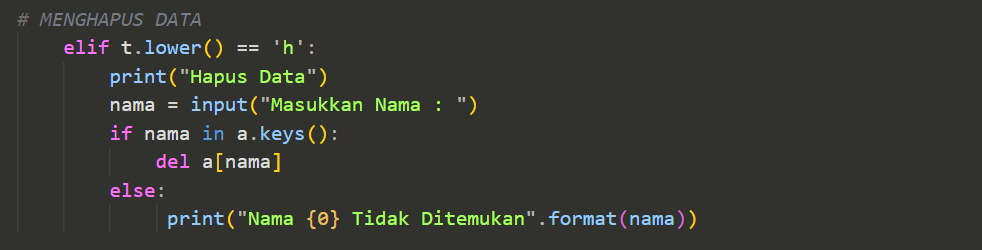

# Nama : Muhammad Iqbal Fadillah

# Kelas : TI.22 B.2

# NIM : 312210586

# Mata Kuliah = Bahasa Pemrograman

# 
===LATIHAN 1===

# 
Penjelasan Program

# Latihan 1

# Code

# Output

# 
===TUGAS PRAKTIKUM===

# 
Penjelasan Program

# Praktikum
Berikut adalah tampilan program sederhana dengan mengaplikasikan penggunaan fungsi yang akan menampilkan daftar nilai mahasiswa, dengan ketentuan:

* Fungsi tambah() untuk menambah data
* Fungsi tapilkan() untuk menampilkan data
* Fungsi hapus(nama) untuk menghapus data berdasarkan nama dan
* Fungsi ubah(nama) untuk mengubah data berdasarkan nama

# <b>Penjelasan</b>

# 1. Menambah Data 
Disini apabila kita menginputkan T maka kita akan diminta untuk menginputkan beberapa data. Data yang kita inputkan akan masuk ke dictionary a yang telah dibuat tadi dengan data nama sebagai keys dan sisanya sebagai values.

# 2. Melihat Data
* Apabila kita menginput L maka sistem akan menampilkan data yang sudah kita masukkan. Jika kita belum memasukkan data maka outputnya menjadi TIDAK ADA DATA.
* Data dalam perulangan for di ambil dari variabel Dictionary a pada bagian value yang berbntuk list. variabel i = 0 digunakan untuk membuat nomer.

# 3. Mengubah Data
* Apabila kita menginput U maka akan ada keterangan untuk mengubah data dan kita akan diminta untuk menginputkan nama yang mau diubah datanya, apabila nama tidak ada maka outputnya Nama {} tidak ditemukan. Dimana {} adalah nama/data yang mau kita ubah.

# 4. Menghapus Data
Apabila kita menginput H maka kita akan diminta menginput nama yang akan dihapus. Jika nama ada di dalam dictionary, maka system akan menghapus keys/nama tersebut beserta valuesnya pada statement del a[nama].

# 5. Mencari Data
* Apabila kita menginputkan C maka kita akan diminta untuk memasukkan nama yang akan dicari. Apabila nama yang dicari ada di dalam dictionary maka outputnya akan menampilkan data dari nama tersebut.

# 6. Keluar Dari Program
* Untuk menghentikan perulangan/keluar dari program kita bisa menginput K. Maka semua perulangan akan berhenti/keluar dari program.

# <b>Output</b>

# 1. Menambah Data 

# 2. Melihat Data

# 3. Mengubah Data

# 4. Menghapus Data

# 5. Mencari Data

# 6. Keluar Dari Program

# <b>FLOWCHART</b>

